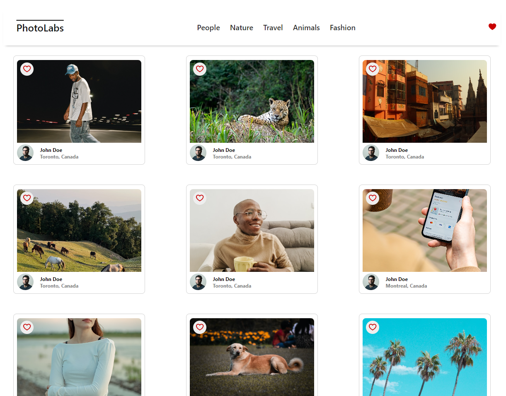
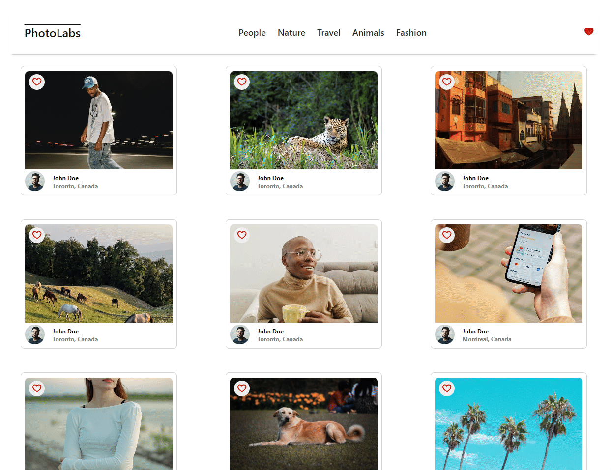

# React PhotoLabs

The PhotoLabs project for the Web Development React course programming.

## Setup

Install dependencies with `npm install` in each respective `/frontend` and `/backend`.

## [Frontend](/frontend/) Running Webpack Development Server

```sh
cd frontend
npm start
```

## [Backend](/backend/) Running Backend Server

Read `backend/readme` for further setup details.

```sh
cd backend
npm start
```

## Opening PhotoLabs

After the intitial startup the frontend of the React Server should automatically load into your browser at http://localhost:3000/

## Browsing PhotoLabs 📸📷📸

Once you are in PhotoLabs you will be greeted with a minimal modern design already showing you photos from the backend api. 😲🌆🖼



See a photo you want a closer look at? No problem! Click the image to bring up a full quality version and photos similar to it. 🔍🔍


Want to view more photos from a specific topic? Just click that topic name!



Alright, we have saved the best for last. We all want to be able to come back to the things we enjoy in life. So we have included a favourite feature where wherever you click the heart button we will remember that you have that photo favourited.💗💖

